# AI-Assist Agent Loop Architecture

Generated from codebase analysis of `~/projects/ai-assist/src/agent/`.

---

## 1. High-Level System Architecture

How all the pieces connect at startup (`main.rs` → `Agent::run()`):

> ⚠️ **Note:** `ToolRegistry::new()` creates an empty registry — no tools are registered in the current codebase. The agentic loop infrastructure is complete but has no tools to call.

---

## 2. Agent Main Loop (`Agent::run()`)

The outer event loop that receives messages and dispatches them:

```mermaid
flowchart TD
    START["Agent::run()"]
    START --> START_CH["channels.start_all()<br/>→ merged MessageStream"]
    START_CH --> SPAWN_PRUNE["Spawn session pruning task<br/>(every 10 min)"]
    SPAWN_PRUNE --> READY["✅ Agent ready and listening"]

    READY --> SELECT{"tokio::select!<br/>(biased)"}

    SELECT -->|"Ctrl+C"| SHUTDOWN["🛑 Shutdown"]
    SELECT -->|"message from stream"| HANDLE["handle_message(&msg)"]

    HANDLE --> RESULT{"Result?"}

    RESULT -->|"Ok(Some(response))<br/>non-empty"| RESPOND["channels.respond(&msg, response)"]
    RESULT -->|"Ok(Some(''))<br/>empty"| SKIP["Skip (approval handled<br/>via send_status)"]
    RESULT -->|"Ok(None)"| SHUTDOWN
    RESULT -->|"Err(e)"| ERR_RESPOND["channels.respond(&msg,<br/>Error: ...)"]

    RESPOND --> SELECT
    SKIP --> SELECT
    ERR_RESPOND --> SELECT

    SHUTDOWN --> CLEANUP["pruning_handle.abort()<br/>channels.shutdown_all()"]
```

---

## 3. Message Dispatch (`handle_message`)

How a raw `IncomingMessage` gets classified and routed:

---

## 4. User Input Processing (`process_user_input`) — The Heart

This is where the magic happens. Every natural language message goes through here:

---

## 5. The Agentic Tool Loop (`run_agentic_loop`) — Core Engine

This is the LLM→Tool→Repeat cycle. Currently has no registered tools, but the infrastructure is production-ready:

```mermaid
flowchart TD
    ENTRY["run_agentic_loop(<br/>msg, session, thread_id,<br/>initial_messages, resume_after_tool)"]

    ENTRY --> LOAD_SYS["Load workspace system prompt<br/>(AGENTS.md, SOUL.md, etc.)"]
    LOAD_SYS --> INIT_REASONING["Reasoning::new(llm, safety)<br/>.with_system_prompt(prompt)"]
    INIT_REASONING --> INIT_CTX["context_messages = initial_messages<br/>job_ctx = JobContext::with_user(...)"]
    INIT_CTX --> INIT_VARS["iteration = 0<br/>tools_executed = resume_after_tool<br/>MAX_TOOL_ITERATIONS = 10"]

    INIT_VARS --> LOOP_START["🔄 LOOP START"]

    LOOP_START --> INC["iteration += 1"]
    INC --> MAX_CHECK{"iteration > 10?"}
    MAX_CHECK -->|"Yes"| ERR_MAX["❌ Error: Exceeded max iterations"]

    MAX_CHECK -->|"No"| INT_CHECK{"Thread interrupted?"}
    INT_CHECK -->|"Yes"| ERR_INT["❌ Error: Interrupted"]

    INT_CHECK -->|"No"| REFRESH["Refresh tool definitions<br/>(tools.tool_definitions().await)"]

    REFRESH --> BUILD_CTX["Build ReasoningContext<br/>messages + tools + metadata"]
    BUILD_CTX --> LLM_CALL["📡 reasoning.respond_with_tools(&context)"]

    LLM_CALL --> LLM_RESULT{"RespondResult?"}

    %% TEXT RESPONSE PATH
    LLM_RESULT -->|"Text(text)"| NUDGE_CHECK{"!tools_executed<br/>&& iteration < 3<br/>&& has_tools?"}
    NUDGE_CHECK -->|"Yes"| NUDGE["Tool Nudge:<br/>Append assistant text<br/>+ 'Please use the available tools...'"]
    NUDGE --> LOOP_START
    NUDGE_CHECK -->|"No"| RETURN_TEXT["✅ Return AgenticLoopResult::Response(text)"]

    %% TOOL CALL PATH
    LLM_RESULT -->|"ToolCalls{calls, content}"| TOOLS_START["tools_executed = true<br/>Append assistant msg with tool_calls"]
    TOOLS_START --> STATUS_EXEC["send_status('Executing N tool(s)...')"]
    STATUS_EXEC --> RECORD_CALLS["Record tool_calls in thread turn"]
    RECORD_CALLS --> TOOL_ITER["For each tool_call"]

    TOOL_ITER --> APPROVAL_CHECK{"tool.requires_approval()?"}
    APPROVAL_CHECK -->|"Yes"| AUTO_CHECK{"Session auto-approved?"}
    AUTO_CHECK -->|"No"| NEED_APPROVAL["⏸️ Return AgenticLoopResult::NeedApproval<br/>(stores context_messages for resume)"]
    AUTO_CHECK -->|"Yes"| EXECUTE

    APPROVAL_CHECK -->|"No"| EXECUTE

    EXECUTE["send_status(ToolStarted)<br/>↓<br/>execute_chat_tool(name, args, ctx)"]
    EXECUTE --> EXEC_DETAIL

    subgraph EXEC_DETAIL["execute_chat_tool()"]
        FIND_TOOL["tools.get(name)"]
        FIND_TOOL --> VALIDATE["safety.validator()<br/>.validate_tool_params()"]
        VALIDATE --> TIMEOUT["tokio::timeout(tool.execution_timeout(),<br/>tool.execute(params, job_ctx))"]
        TIMEOUT --> SERIALIZE["serde_json::to_string_pretty(result)"]
    end

    EXEC_DETAIL --> TOOL_STATUS["send_status(ToolCompleted)<br/>+ send_status(ToolResult) if output"]
    TOOL_STATUS --> RECORD_RESULT["Record result/error in thread turn"]
    RECORD_RESULT --> SANITIZE["safety.sanitize_tool_output()<br/>safety.wrap_for_llm()"]
    SANITIZE --> ADD_RESULT["Append ChatMessage::tool_result<br/>to context_messages"]
    ADD_RESULT --> NEXT_TOOL{"More tool_calls?"}
    NEXT_TOOL -->|"Yes"| TOOL_ITER
    NEXT_TOOL -->|"No"| LOOP_START

    style LOOP_START fill:#ffdd99,stroke:#cc8800,stroke-width:2px
    style LLM_CALL fill:#ddbbff,stroke:#7700cc,stroke-width:2px
    style EXECUTE fill:#bbddff,stroke:#0055cc
    style NEED_APPROVAL fill:#ffcc99,stroke:#cc6600
    style RETURN_TEXT fill:#bbffbb,stroke:#009900
    style NUDGE fill:#ffffaa,stroke:#aa8800
```

---

## 6. Tool Approval Flow (`process_approval` + `finalize_loop_result`)

What happens when a tool needs user permission:

---

## 7. Context Compaction Flow

How conversations avoid blowing the context window:

---

## 8. Card Generation Flow (Unique to AI-Assist)

The fire-and-forget card system that powers the iOS swipe UI:

```mermaid
flowchart LR
    subgraph "Incoming Message"
        MSG["User sends message<br/>(Telegram / Email / CLI)"]
    end

    subgraph "Agent Turn (parallel)"
        AGENTIC["Agentic Loop<br/>(LLM response)"]
    end

    subgraph "Card Generation (fire-and-forget)"
        GEN["CardGenerator.generate_cards()"]
        GEN --> SHOULD{"should_generate?<br/>(not empty, not /cmd,<br/>not emoji-only)"}
        SHOULD -->|"Yes"| LLM_CARDS["LLM call (temp=0.3):<br/>'Generate 3 reply suggestions<br/>for this message'"]
        SHOULD -->|"No"| SKIP["Skip"]
        LLM_CARDS --> PARSE["Parse ReplyCard[]<br/>(suggestion, confidence, tone)"]
        PARSE --> QUEUE["CardQueue.push(cards)"]
    end

    subgraph "Card Delivery"
        QUEUE --> WS["WebSocket /ws<br/>→ iOS App"]
        QUEUE --> REST["REST /api/cards<br/>→ iOS App polling"]
        QUEUE --> STORE["CardStore<br/>(SQLite persistence)"]
    end

    subgraph "iOS App"
        SWIPE["User swipes card"]
        SWIPE -->|"Approve"| SEND["Send reply via channel"]
        SWIPE -->|"Edit"| EDIT["Edit → Send"]
        SWIPE -->|"Dismiss"| ARCHIVE["Archive card"]
    end

    MSG --> AGENTIC
    MSG --> GEN

    STORE --> EXPIRY["Expiry sweep<br/>(every 60s,<br/>default 15 min TTL)"]

    style GEN fill:#99ddff,stroke:#0066cc
    style WS fill:#ccffcc,stroke:#009900
```

---

## 9. Session & Thread Model

The data structures that maintain conversation state:

---

## 10. What's Missing (Current State)

```mermaid
graph LR
    subgraph "✅ Built & Working"
        A1["Agent main loop"]
        A2["Agentic tool loop<br/>(LLM→Tool→Repeat)"]
        A3["Tool approval flow"]
        A4["Context compaction"]
        A5["Undo/Redo"]
        A6["Session management"]
        A7["Card generation"]
        A8["4 Channels<br/>(CLI, iOS, Telegram, Email)"]
        A9["Safety layer"]
        A10["DB persistence"]
    end

    subgraph "❌ Not Registered / Stub"
        B1["ToolRegistry is EMPTY<br/>(no tools registered in main.rs)"]
        B2["Workspace is None<br/>(no file system access)"]
        B3["ExtensionManager is None"]
        B4["Database store is None<br/>(agent deps, not card DB)"]
    end

    subgraph "🔮 Available in IronClaw<br/>(not ported)"
        C1["Job Scheduler"]
        C2["Self-Repair"]
        C3["Routine Engine"]
        C4["Heartbeat Runner"]
        C5["Auth Mode"]
        C6["WASM Runtime"]
        C7["MCP Client"]
        C8["Sandbox/Container"]
    end

    style B1 fill:#ff9999,stroke:#cc0000,stroke-width:3px
    style B2 fill:#ff9999,stroke:#cc0000
    style B3 fill:#ffcccc,stroke:#cc6666
    style B4 fill:#ffcccc,stroke:#cc6666
```

---

## File Map

| File | Purpose | Lines |
|------|---------|-------|
| `agent/agent_loop.rs` | Agent struct, main loop, message dispatch, thread hydration, user input processing | ~450 |
| `agent/tool_executor.rs` | Agentic loop (LLM→tool→repeat), tool execution | ~280 |
| `agent/approval.rs` | Tool approval/rejection flow, finalize_loop_result | ~210 |
| `agent/commands.rs` | Slash commands, system commands | ~100 |
| `agent/session.rs` | Session, Thread, Turn, PendingApproval models | ~1000 |
| `agent/session_manager.rs` | Session lifecycle, thread resolution | ~200 |
| `agent/context_monitor.rs` | Context size monitoring, compaction triggers | ~240 |
| `agent/compaction.rs` | LLM summarization, truncation, workspace archival | ~250 |
| `agent/submission.rs` | Input parsing (commands, approvals, user text) | ~670 |
| `agent/undo.rs` | Checkpoint-based undo/redo | ~150 |
| `cards/generator.rs` | LLM-based reply card generation | ~410 |
| `cards/queue.rs` | Card queue with persistence | ~300 |
| `cards/ws.rs` | WebSocket + REST card server | ~200 |
| `channels/*.rs` | CLI, Telegram, iOS, Email channels | ~1500 |
| `main.rs` | Wiring, startup, config | ~220 |
