# AI-Assist Architecture

Generated from codebase analysis. Last updated: 2026-02-25.

---

## 1. High-Level System Architecture

How all the pieces connect at startup (`main.rs` → `Agent::run()`):

---

## 2. Agent Main Loop (`Agent::run()`)

The outer event loop that receives messages and dispatches them:

```mermaid
flowchart TD
    START["Agent::run()"]
    START --> START_CH["channels.start_all()<br/>→ merged MessageStream"]
    START_CH --> SPAWN_PRUNE["Spawn session pruning task<br/>(every 10 min)"]
    SPAWN_PRUNE --> READY["✅ Agent ready and listening"]

    READY --> SELECT{"tokio::select!<br/>(biased)"}

    SELECT -->|"Ctrl+C"| SHUTDOWN["🛑 Shutdown"]
    SELECT -->|"message from stream"| HANDLE["handle_message(&msg)"]

    HANDLE --> RESULT{"Result?"}

    RESULT -->|"Ok(Some(response))<br/>non-empty"| RESPOND["channels.respond(&msg, response)"]
    RESULT -->|"Ok(Some(''))<br/>empty"| SKIP["Skip (approval handled<br/>via send_status)"]
    RESULT -->|"Ok(None)"| SHUTDOWN
    RESULT -->|"Err(e)"| ERR_RESPOND["channels.respond(&msg,<br/>Error: ...)"]

    RESPOND --> SELECT
    SKIP --> SELECT
    ERR_RESPOND --> SELECT

    SHUTDOWN --> CLEANUP["pruning_handle.abort()<br/>channels.shutdown_all()"]
```

---

## 3. Message Dispatch (`handle_message`)

How a raw `IncomingMessage` gets classified and routed:

---

## 4. User Input Processing (`process_user_input`)

Every natural language message goes through here:

```mermaid
flowchart TD
    INPUT["process_user_input(msg, session, thread_id, content)"]

    INPUT --> CHECK_STATE{"Thread State?"}
    CHECK_STATE -->|"Processing"| REJECT1["❌ 'Turn in progress'"]
    CHECK_STATE -->|"AwaitingApproval"| REJECT2["❌ 'Waiting for approval'"]
    CHECK_STATE -->|"Completed"| REJECT3["❌ 'Thread completed'"]
    CHECK_STATE -->|"Idle / Interrupted"| SAFETY

    SAFETY["Safety Validation"]
    SAFETY --> VALIDATE_INPUT["safety.validate_input(content)"]
    VALIDATE_INPUT --> POLICY["safety.check_policy(content)"]
    POLICY --> POLICY_CHECK{"Blocked?"}
    POLICY_CHECK -->|"Yes"| REJECT4["❌ 'Input rejected'"]
    POLICY_CHECK -->|"No"| CARDS

    CARDS["🃏 Fire-and-forget: Card Generation"]
    CARDS --> CARD_SPAWN["tokio::spawn(<br/>card_gen.generate_cards(content,<br/>sender, chat_id, channel,<br/>tracked_msg_id, thread_messages,<br/>reply_metadata, email_thread))"]

    CARD_SPAWN --> COMPACT_CHECK

    COMPACT_CHECK["Auto-Compaction Check"]
    COMPACT_CHECK --> CTX_MON{"context_monitor<br/>.suggest_compaction()"}
    CTX_MON -->|"Some(strategy)"| DO_COMPACT["ContextCompactor::compact()<br/>+ notify user 'compacting...'"]
    CTX_MON -->|"None"| CHECKPOINT
    DO_COMPACT --> CHECKPOINT

    CHECKPOINT["Create Undo Checkpoint<br/>undo_mgr.checkpoint(turn, messages)"]

    CHECKPOINT --> START_TURN["thread.start_turn(content)<br/>→ adds user message to thread"]

    START_TURN --> SYSTEM_PROMPT{"Has system_prompt<br/>in config?"}
    SYSTEM_PROMPT -->|"Yes + not present"| PREPEND["Prepend system prompt<br/>to messages"]
    SYSTEM_PROMPT -->|"No / already there"| THINK
    PREPEND --> THINK

    THINK["📡 send_status(Thinking: 'Processing...')"]

    THINK --> AGENTIC["🔄 run_agentic_loop(<br/>msg, session, thread_id,<br/>turn_messages, false)"]

    AGENTIC --> INT_CHECK{"Interrupted?"}
    INT_CHECK -->|"Yes"| INT_RESULT["send_status('Interrupted')<br/>→ SubmissionResult::Interrupted"]

    INT_CHECK -->|"No"| FINALIZE["finalize_loop_result()"]

    FINALIZE --> FIN_CHECK{"AgenticLoopResult?"}
    FIN_CHECK -->|"Response(text)"| COMPLETE["thread.complete_turn(text)<br/>persist_response_chain()<br/>persist_turn() (fire-and-forget)<br/>→ SubmissionResult::Response"]
    FIN_CHECK -->|"NeedApproval"| AWAIT["thread.await_approval(pending)<br/>→ SubmissionResult::NeedApproval"]
    FIN_CHECK -->|"Err(e)"| FAIL["thread.fail_turn(e)<br/>persist_turn() (user msg only)<br/>→ SubmissionResult::Error"]

    style AGENTIC fill:#ffdd99,stroke:#cc8800,stroke-width:3px
    style CARDS fill:#99ddff,stroke:#0066cc
    style SAFETY fill:#ffcccc,stroke:#cc0000
    style CHECKPOINT fill:#ccffcc,stroke:#009900
```

---

## 5. The Agentic Tool Loop (`run_agentic_loop`)

The LLM→Tool→Repeat cycle:

---

## 6. Tool Approval Flow

What happens when a tool needs user permission:

---

## 7. Context Compaction Flow

How conversations avoid blowing the context window:

---

## 8. Approval Card System

The typed card system that powers the iOS swipe UI:

```mermaid
flowchart TD
    subgraph "Inbound Sources"
        TG["Telegram Message"]
        EMAIL["Email Message"]
        PIPE["Message Pipeline<br/>(Rules + LLM Triage)"]
    end

    subgraph "Card Generation"
        GEN["CardGenerator.generate_cards()"]
        GEN --> SHOULD{"should_generate?<br/>(not empty, not /cmd,<br/>not emoji-only)"}
        SHOULD -->|"Yes"| LLM_CARDS["LLM call (temp=0.3):<br/>'Generate best reply suggestion'"]
        SHOULD -->|"No"| SKIP["Skip"]
        LLM_CARDS --> PARSE["Parse ApprovalCard<br/>with CardPayload"]
    end

    subgraph "Card Types"
        REPLY["Reply<br/>channel, sender, message,<br/>suggested_reply, confidence,<br/>thread context, email_thread"]
        COMPOSE["Compose<br/>channel, recipient,<br/>subject, draft_body"]
        ACTION["Action<br/>description,<br/>action_detail"]
        DECISION["Decision<br/>question, context,<br/>options[]"]
    end

    subgraph "Storage & Delivery"
        QUEUE["CardQueue<br/>(broadcast fan-out)"]
        DB_STORE["SQLite<br/>(cards table, V6 schema)"]
        WS["WebSocket /ws"]
        REST["REST /api/cards"]
        SILO["SiloCounts<br/>broadcast"]
    end

    subgraph "iOS App (SwiftUI)"
        TABS["Tab Bar<br/>Messages · Todos · Calendar · Brain"]
        BADGES["Live Badge Counts<br/>(from SiloCounts)"]
        SWIPE["Swipe Actions"]
        SWIPE -->|"Right swipe"| APPROVE["Approve → Send reply"]
        SWIPE -->|"Left swipe"| DISMISS["Dismiss → Archive"]
        SWIPE -->|"Tap edit"| EDIT["Edit → Modify → Send"]
    end

    TG --> GEN
    EMAIL --> GEN
    PIPE --> GEN

    PARSE --> REPLY
    PARSE --> COMPOSE
    PARSE --> ACTION
    PARSE --> DECISION

    REPLY --> QUEUE
    COMPOSE --> QUEUE
    ACTION --> QUEUE
    DECISION --> QUEUE

    QUEUE --> DB_STORE
    QUEUE --> WS
    QUEUE --> REST
    QUEUE --> SILO

    WS --> TABS
    SILO --> BADGES

    style REPLY fill:#99ddff,stroke:#0066cc
    style COMPOSE fill:#ccffcc,stroke:#009900
    style ACTION fill:#ffcc99,stroke:#cc6600
    style DECISION fill:#ddbbff,stroke:#7700cc
    style QUEUE fill:#ffffaa,stroke:#aa8800
```

---

## 9. Message Pipeline

Inbound message triage — rules engine then LLM:

**Core invariant: No outbound message without human approval.** All outbound goes through cards. There is NO auto-reply path.

---

## 10. Routine Engine

Background task execution with triggers and guardrails:

```mermaid
flowchart TD
    subgraph "Triggers"
        CRON["⏰ Cron<br/>(schedule expression)"]
        EVENT["📨 Event<br/>(channel + pattern match)"]
        WEBHOOK["🔗 Webhook<br/>(HTTP POST + optional secret)"]
        MANUAL["🖐️ Manual<br/>(tool call / CLI)"]
    end

    subgraph "Routine Engine"
        TICKER["Cron Ticker<br/>(configurable interval)"]
        CACHE["Event Cache<br/>(in-memory, refreshed on change)"]
        EXEC["execute_routine()"]
    end

    subgraph "Guardrails"
        MAX_TOK["max_tokens: 2048"]
        MAX_COST["max_cost_per_run: $0.10"]
        COOLDOWN["cooldown: Duration"]
        FAILURES["consecutive_failures<br/>(auto-disable threshold)"]
    end

    subgraph "Execution"
        LLM_CALL["LLM Call<br/>(routine prompt + context)"]
        RECORD["Record run in DB<br/>(routine_runs table)"]
        NOTIFY["Send notification<br/>via channel"]
        COST["Record LLM costs<br/>(llm_calls table)"]
    end

    CRON --> TICKER
    TICKER --> EXEC
    EVENT --> CACHE
    CACHE --> EXEC
    WEBHOOK --> EXEC
    MANUAL --> EXEC

    EXEC --> MAX_TOK
    EXEC --> MAX_COST
    EXEC --> COOLDOWN
    EXEC --> FAILURES

    EXEC --> LLM_CALL
    LLM_CALL --> RECORD
    LLM_CALL --> NOTIFY
    LLM_CALL --> COST

    style CRON fill:#99ddff,stroke:#0066cc
    style EVENT fill:#ccffcc,stroke:#009900
    style WEBHOOK fill:#ffcc99,stroke:#cc6600
    style MANUAL fill:#ddbbff,stroke:#7700cc
```

### LLM-Facing Routine Tools

| Tool | Purpose |
|------|---------|
| `routine_create` | Create a new routine with trigger, action, guardrails |
| `routine_list` | List all routines with status and next fire time |
| `routine_update` | Modify name, description, trigger, action, or toggle enabled |
| `routine_delete` | Remove a routine permanently |
| `routine_history` | View past runs (success/failure, duration, output) |

---

## 11. Todo System

---

## 12. Database Schema (V6)

---

## 13. Session & Thread Model

---

## 14. Built-in Tools

All tools implement the `Tool` trait:
- `name()`, `description()`, `parameters_schema()` — LLM-facing metadata
- `execute(params, job_ctx)` — async execution
- `requires_approval()` — all built-in tools return `true`
- `execution_timeout()` — default 120s (shell), varies by tool

---

## 15. File Map

| Module | File | Purpose | Lines |
|--------|------|---------|-------|
| **agent** | `agent_loop.rs` | Agent struct, main loop, message dispatch, thread hydration | 905 |
| | `tool_executor.rs` | Agentic loop (LLM→tool→repeat), tool execution | 439 |
| | `approval.rs` | Tool approval/rejection flow, finalize_loop_result | 283 |
| | `commands.rs` | Slash commands, system commands | 464 |
| | `session.rs` | Session, Thread, Turn, PendingApproval models | 1,000 |
| | `session_manager.rs` | Session lifecycle, thread resolution, DB hydration | 674 |
| | `context_monitor.rs` | Context size monitoring, compaction triggers | 236 |
| | `compaction.rs` | LLM summarization, truncation, workspace archival | 324 |
| | `submission.rs` | Input parsing (commands, approvals, user text) | 689 |
| | `router.rs` | Command routing | 200 |
| | `undo.rs` | Checkpoint-based undo/redo | 252 |
| | `routine.rs` | Routine types (Trigger, Action, Guardrails, Notify) | 496 |
| | `routine_engine.rs` | Routine execution engine, cron ticker, event cache | 609 |
| **cards** | `model.rs` | ApprovalCard, CardPayload, CardSilo, SiloCounts | 763 |
| | `queue.rs` | CardQueue with DB persistence + broadcast | 651 |
| | `generator.rs` | LLM-powered card generation | 424 |
| | `ws.rs` | Axum WebSocket + REST card endpoints | 413 |
| **channels** | `email.rs` | IMAP/SMTP email channel | 1,187 |
| | `telegram.rs` | Telegram Bot API (long-polling, rich media) | 1,082 |
| | `ios.rs` | iOS WebSocket chat channel | 426 |
| | `cli.rs` | stdin/stdout REPL | 115 |
| | `manager.rs` | Multi-channel routing + stream merging | 164 |
| | `channel.rs` | Channel trait, IncomingMessage, OutgoingResponse | 186 |
| **llm** | `reasoning.rs` | Reasoning engine (respond_with_tools, plan, evaluate) | 1,032 |
| | `failover.rs` | Multi-provider failover chain | 482 |
| | `rig_adapter.rs` | rig-core → LlmProvider bridge | 451 |
| | `provider.rs` | LlmProvider trait, ChatMessage, ToolCall types | 307 |
| | `costs.rs` | Token cost lookup tables | 124 |
| | `retry.rs` | Exponential backoff with jitter | 96 |
| **pipeline** | `processor.rs` | MessageProcessor (rules → triage → card routing) | 985 |
| | `rules.rs` | Rules engine (fast, no LLM) | 434 |
| | `types.rs` | InboundMessage, TriageAction, ProcessedMessage | 322 |
| **store** | `libsql_backend.rs` | libSQL/SQLite implementation | 3,476 |
| | `migrations.rs` | Version-tracked migrations (V1–V6) | 563 |
| | `traits.rs` | Unified Database trait | (in traits.rs) |
| **todos** | `model.rs` | TodoItem, TodoType, TodoBucket, TodoStatus | 341 |
| | `ws.rs` | WebSocket + REST endpoints for todos | 333 |
| **tools** | `builtin/shell.rs` | ShellTool | 514 |
| | `builtin/file.rs` | ReadFile, WriteFile, ListDir, ApplyPatch | 935 |
| | `builtin/memory.rs` | MemorySearch, MemoryRead, MemoryWrite | 536 |
| | `builtin/routine.rs` | 5 routine management tools | 534 |
| | `tool.rs` | Tool trait, ToolOutput, ToolDomain | — |
| | `registry.rs` | ToolRegistry | — |
| **core** | `main.rs` | Wiring, startup, config | 248 |
| | `workspace.rs` | File-backed workspace + identity loader | 379 |
| | `config.rs` | AgentConfig, RoutineConfig, defaults | — |
| | `safety.rs` | SafetyLayer | — |

**Total: ~26,500 lines of Rust across 62 files, ~5,400 lines of Swift across 29 files.**
